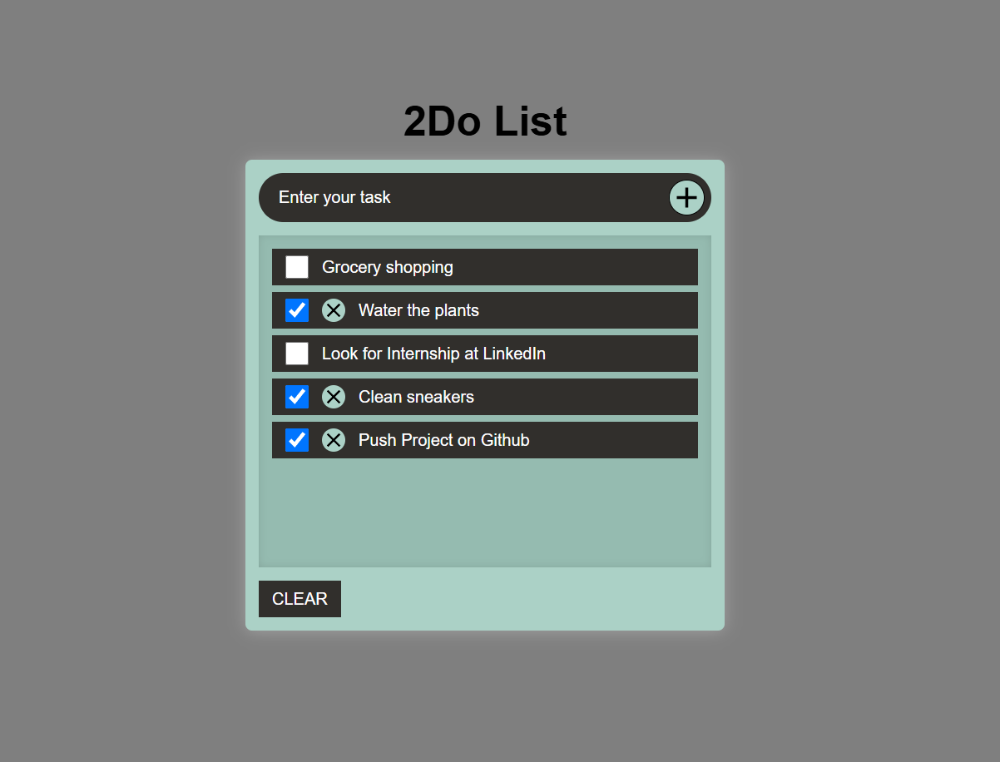

# 📝 Simple To-Do List App

A clean and effective to-do list application to help you stay organized throughout your day. This app runs entirely in the browser and uses **localStorage** to save your tasks — no backend, no sign-in, just quick productivity.

## ✨ Features

- ✅ Add new daily tasks
- ☑️ Check off completed tasks
- ❌ Remove individual tasks
- 🧹 Clear all tasks with one click
- 💾 Tasks are saved in your browser (localStorage) — no data loss on refresh

## 📸 Preview

